# Universidad Centroamericana José Simeón Cañas

# Ciclo 01/2023, Laboratorio: Cableado UTP
### Catedrática: Elisa Aldana 
### 2023, Antiguo Cuscatlán

## Cable UTP

El cable de par trenzado es el cable más comúnmente utilizado para establecer comunicaciones de datos a través de una red. Recibe su nombre debido a que tiene dos conductores eléctricos aislados y a su vez entrelazados para anular las interferencias causadas por las fuentes eléctricas externas y ondas electromagnéticas.

En la actualidad un cable de par trenzado no solamente tiene dos de estos cables entrelazados, sino que cuenta con un mayor número de ellos. Eso sí, siempre en número par y siempre entrelazados dos a dos en forma helicoidal. El inventor de este tipo de cables fue un tal Alexander Grahan Bell en 1881, Bell descubrió que las ondas que viajan por dos cables independientes y entrelazados helicoidalmente son canceladas, lo que provoca una reducción de las interferencias que se producen, mejorando con ello la transmisión de datos.

Y lo más interesante sin dudas, es que si agrupamos un conjunto de cables entrelazados dos a dos también nos estaremos asegurando de que cada uno de estos grupos tengan menos interferencias de ellos mismos y de los grupos a su alrededor, e incluso de las acciones externas como cables de mayor tensión o microondas que atraviesen este medio físico.
Cada uno de estos pares trenzados estará identificado mediante un material aislante y un color para diferenciar cada uno de los pares y cada uno de los conductores. En cada uno de estos pares, la señal eléctrica va configurada en modo diferencial, es decir, una es la inversa de la otra. De este modo el ruido de ambas señales de anula, de lo contrario lo que haría es sumarse.

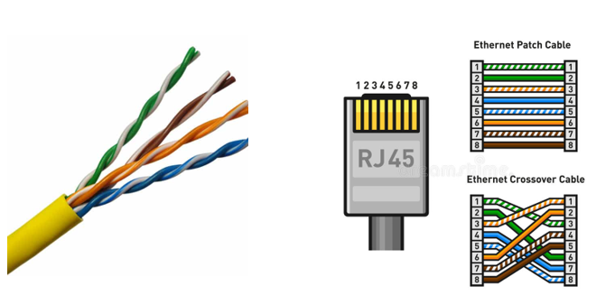

## Principales ventajas

•	Facilidad de utilización e instalación
•	Bajo coste de fabricación y adquisición
•	Gran capacidad de transmisión de datos en redes de área local
•	Rápida conectividad y actualizable
•	Buena latencia en redes LAN

## Principales desventajas

•	No son inmunes al ruido
•	Ancho de banda limitado frente a cables de fibra
•	Distancia limitada y necesidad de repetidores
•	Tasas de error a considerar en altas velocidades

## Cable UTP

Son siglas de “Unshielded Twisted Pair” o cable de par trenzado sin blindaje. Este tipo de cables contienen sus pares trenzados sin blindar, es decir, entre cada una de las parejas de cables no existe un medio de separación que los aísle de las otras parejas.
Casi siempre es utilizado en redes locales de corta distancia, ya que, al estar más expuestos, la señal se irá degradando si no se introduce un repetidor de señal cada poco. Estos cables son de bajo coste y normalmente tienen una impedancia característica de 100 Ω.

## Cable FTP

Siglas de “Foiled Twisted Pair” o cable de par trenzado apantallado. En este caso tenemos un cable cuyos pares trenzados están separados entre ellos por un sistema básico basado en plástico o material no conductor. En este caso el apantallamiento no es individual, sino global que envuelve a todo el grupo de pares trenzados, y está construido de aluminio.

## Cable STP

Pasamos al siguiente cable de esta lista, cuyas siglas significan “Shielded twisted pair” o en español, par trenzado blindado individual. En este caso ya sí que tenemos cada uno de los pares trenzados rodeados de una cubierta de protección normalmente hecha de aluminio.
Estos cables se utilizan en redes que requieren más altas prestaciones como los nuevos estándares Ethernet, en donde se necesita un alto ancho de banda, latencias muy bajas y bajísimas tasas de error de bit. Son cables más caros que los anteriores y permiten trazar mayores distancias sin necesidad de repetidor. Su impedancia característica es de 150 Ω.

## Cable SSTP

“Screened Shielded Twisted Pair” o cable de pares trenzados laminado blindado individual. El trabalenguas se complica aquí, ahora tenemos un cable con la estructura propia de un cable STP, es decir con cada uno de los pares recubierto por aluminio. Pero a su vez también encontramos un forro global alrededor de material LSZH.

Este cable es el de más altas prestaciones, con excelente protección frente a altas frecuencias y gran capacidad de trasmisión a largas distancias. Su pantalla global irá de forma general conectada a la toma de tierra de los equipos, para eliminar tensiones residuales. Por supuesto es el cable de mayor coste de la lista.
## Cable SFTP

“Screened Foiled Twisted Pair” o cable laminado apantallado individual. Este cable se basa en la construcción del cable FTP, pero en el apantallamiento global se le ha añadido una malla metálica LSZH alrededor para aumentar el aislamiento de este cable. Al igual que el anterior, esta lámina irá conectada a la toma de tierra en los dispositivos que la tengan.

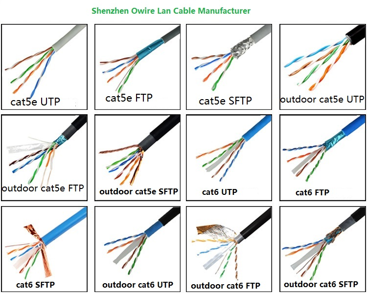

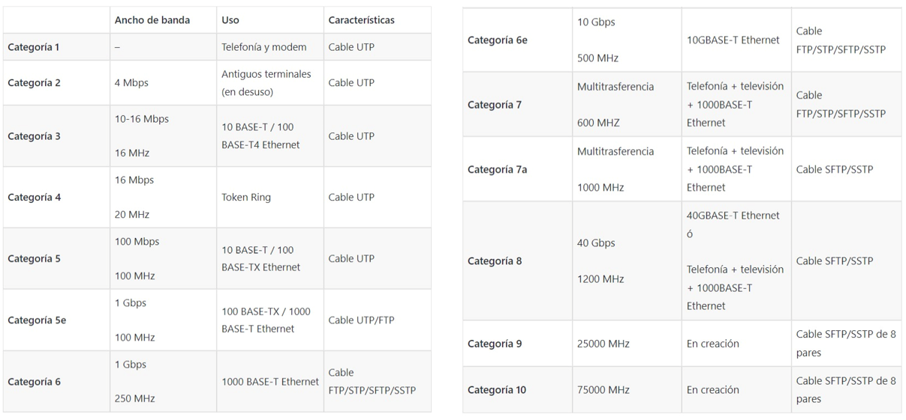

# Práctica de cableado

## Normas de cable de red: 

Estas normas están dentro de los estándares que definen el cableado comercial para productos y servicios de telecomunicaciones.

**Directo o paralelo:** Sencillo de construir, únicamente se requiere que se aplique la misma norma en ambos extremos del cable. Usado comúnmente para conectar ordenadores a equipos activos de red (Hubs, Switch, Router).

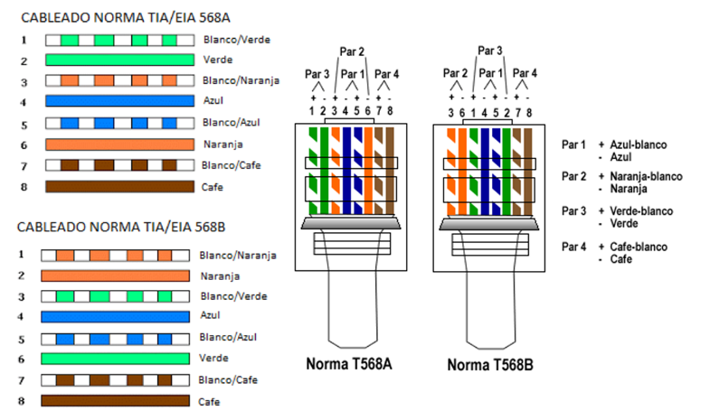

**Cruzado:** Un poco mas complejo de construir, se debe de usar una norma diferente en cada terminal, comúnmente se usa la T568A en un extremo y la T568B en el otro. Este cableado se usa para conectar dispositivos directamente sin necesidad de un hub o Switch.

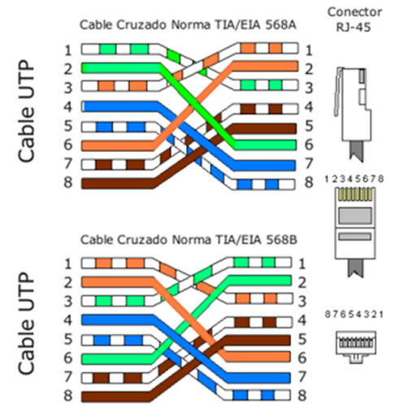

**Jacket RJ-45** (cable UTP) Es una interfaz física comúnmente usada para conectar redes de computadoras con cableado estructurado. Posee ocho pones o conexiones eléctricas.

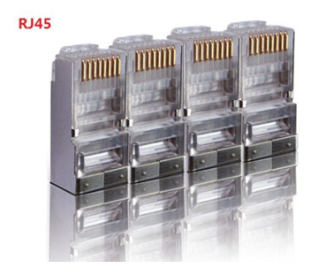

# Práctica 
## Materiales: 
1. Cable de Red 
2. Conectores RJ-45 Macho y Hembra 
3. Ponchadora Macho y Hembra 
4. Tester UTP 
5. Alicate 

## Procedimiento para cable 1
Haciendo uso de la ponchadora remover la cobertura plástica del cable a 2.5 cm del borde aproximadamente.

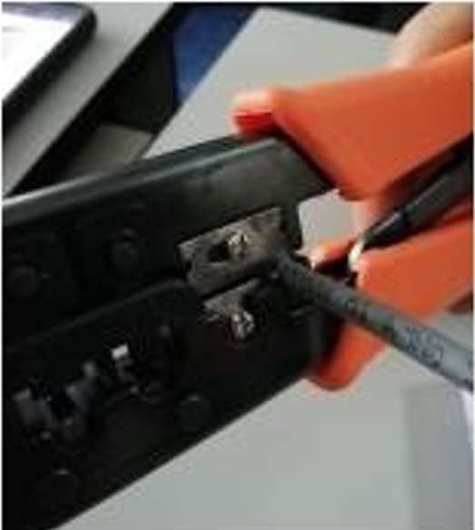

1.	Observaras que quedan libres unos cables mas pequeños de colores, a continuación, deberás de desenrollarlos y ordenarlos en parejas según color **(Verde – Blanco Verde**)

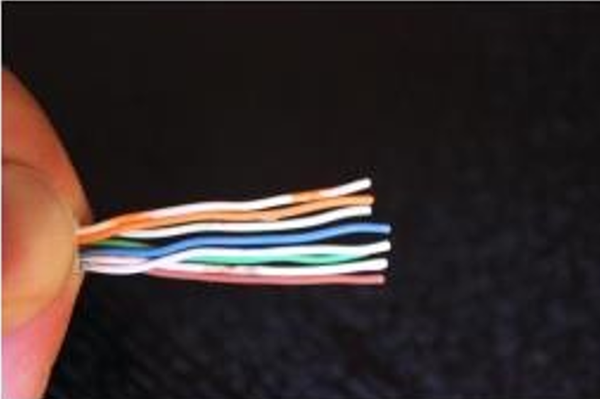

2.	A continuación, procederemos a ordenar los colores según la norma T568B en ambos extremos, posteriormente sujetaremos los cables firmemente y con la ponchadora realizaremos un corte a modo que los pares queden ordenados y lo más rectos posibles.

3.	A continuación, colocaremos **dentro del terminal RJ-45 los cables**, verifica bien que todos los alambres de colores lleguen al final del terminal. (Puedes pedir ayuda a tu instructor para verificar que todo esté bien).

4.	Cuidando el paso anterior coloca el terminal en la ponchadora y presiona hasta escuchar un “**click**”.

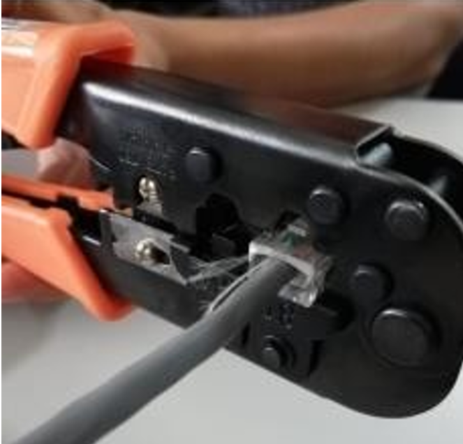

5.	Repite los pasos anteriores en el otro extremo del cable.

6.	Por último, verificaremos que el cable funciona, haciendo uso del tester. Coloca ambos extremos del cable en las ranuras superiores del aparato, coloca el interruptor lateral en ON. Los leds indican la continuidad y el paso de información en cada uno de los pines del cable, si alguno no enciende implica que el cable no está funcionando bien, por lo que hay que repetir nuevamente todo el proceso.

## Procedimiento para cable 2 

7.	Tomamos otro cable utp y con la ponchadora recortar nuevamente la cubierta de plástico de uno de los extremos del cable. A continuación, separaremos los cables de colores a modo de poder manipularlos con libertad.

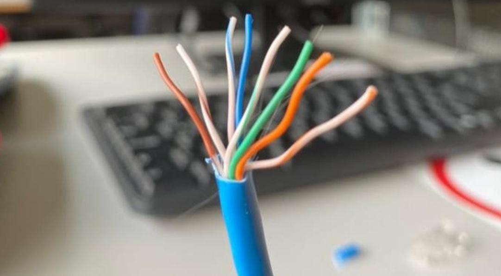

8.	Tomaremos el terminal hembra, y notaremos que en los extremos habrá unos códigos de color que indican que pin corresponde a cada puerto según la norma deseada.

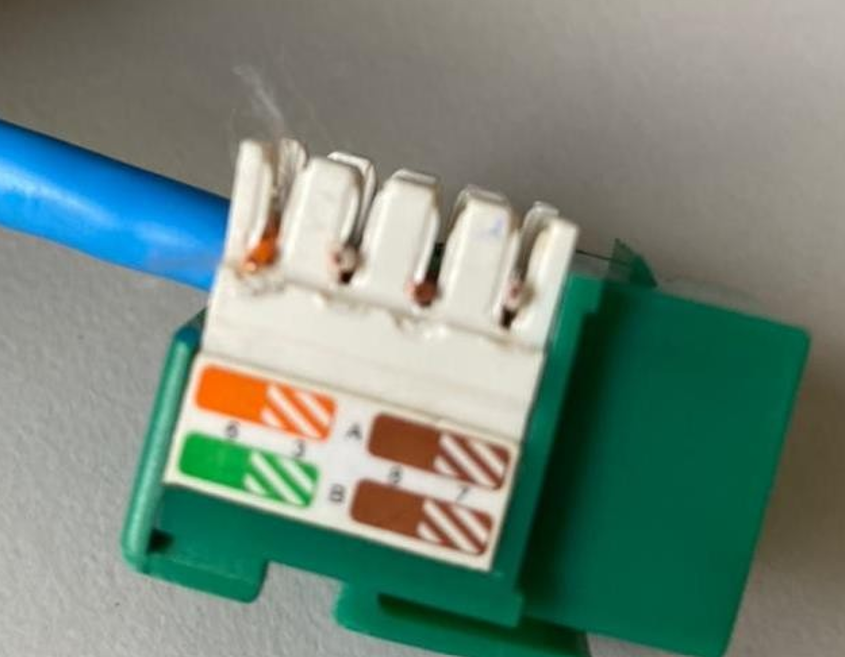

9.	A continuación, procederemos a colocar los pines (cables) en las ranuras del terminal hembra en el orden de color según a la norma escogida.

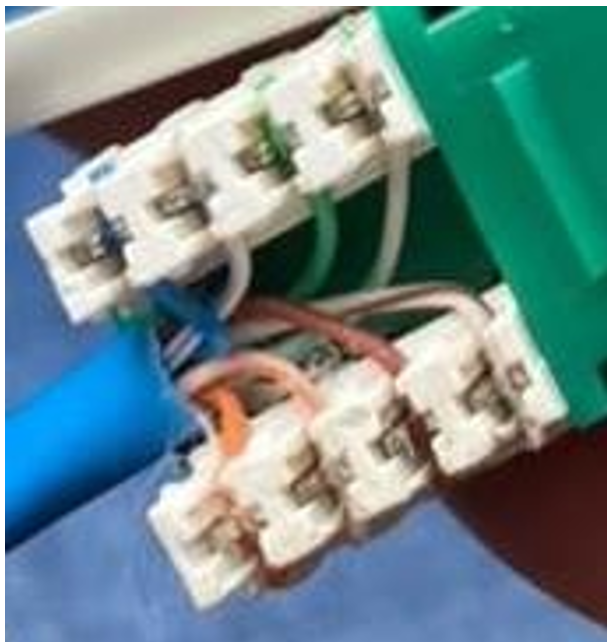

10.	Con la remachadora, procederemos a ponchar cada uno de los cables en la terminal, tomando en cuenta que el extremo con navaja debe ir hacia afuera. (Preguntar al instructor).

11.	Ahora en el otro extremo, se colocará un terminal **RJ-45 macho**. Utilizando el estándar que se ve reflejado en el **RJ-45 hembra**.(Revisar procedimiento anterior)

12.	Probaremos la conectividad del cable, nos apoyaremos del cable realizado en la práctica anterior. Colocaremos un extremo del cable de terminales macho en el terminal hembra y los dos extremos restantes en el tester.

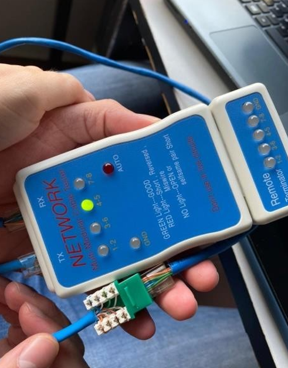

